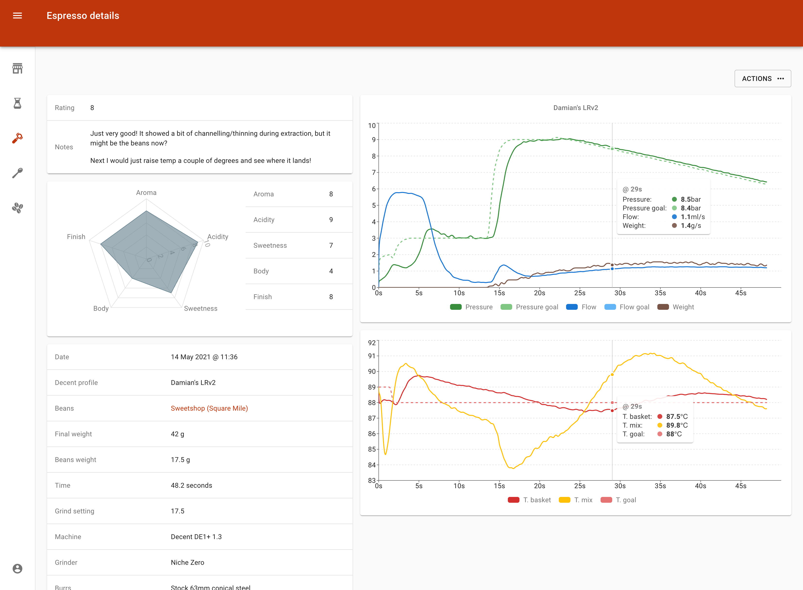

# Memento

Memento helps you keep track of all your coffee brewing at home:

- Coffee beans
- Brew/filter
- Espresso
- Tastings (experimental)

## Who is this for?

Memento is for you if you:

- want to achieve tasty, repeatable coffee 
- have several coffee beans open at any given time and want to remember each individual settings
- painstakingly keep track of all your coffee data on a whiteboard, spreadsheet, etc. and are looking for a better and easier way
- want to record the outcome and flavour notes of espresso/filter coffee to improve upon

## Features

A list of some of the features:

- Strong focus on making form filling as quick as possible, thanks to one-tap autosuggestions based on what you previously entered
- Scales beautifully from mobile all the way to ultra-wide screens
  - Optimised to behave like a native app when added to your [iPhone](https://support.apple.com/en-gb/guide/iphone/iph42ab2f3a7/ios#iph4f9a47bbc) or Android home screen
- Integrated timer when adding brews/espressos
- Clone feature to add new brews/espressos based on existing ones
- Real-time updating when using multiple devices
- Dark mode
- Guest access if you want to try it on a single device before you sign up

Want to make a suggestion for a new feature or have your say on a planned one? Found a nasty bug that is driving you crazy? Head over to the [issues section](https://github.com/stassinari/memento/issues)!

## Decent Espresso integration

If you're lucky enough to own a Decent Espresso machine, there is a handy plugin that lets you automatically upload your shots as soon as they finish.

The way it works is heavily borrowed from the amazing [Decent Visualizer](https://github.com/miharekar/decent-visualizer), so, when everything is properly set up, you'll see a new espresso pop up as soon as the machine finishes a shot.

The end result will look something like this:

In order to have the integration running, follow these steps:

On Memento:

1. (Prerequisite) Sign up as a registered user (it won't work for guest users)
2. Navigate to your _Account_ page and genereate a **secret key**
3. You're going to need both your secret and your email (both on the _Account_ page for easy copy/pasting) 

From the GitHub repo:

3. Download the [`plugin.tcl` file](external/decent/memento_uploader/plugin.tcl) to your computer
4. (Optional) Download the [`settings.tdb` file](external/decent/memento_uploader/settings.tdb) to your computer. If you skip this step, you'll have to enter your email and secret manually from the tablet interface
   - Open the `settings.tdb` file with any text editor and replace the `memento_username` and `memento_password` values with your email and secret respectively

On your tablet running the Decent app:

5. Create a folder called `memento_uploader` in the `plugins` folder inside of `de1plus`
6. Transfer the `plugin.tcl` (and optionally the `settings.tdb`) to the above folder
7. Navigate to the *Extensions* page on the Decent app and enable the **Upload to Memento** extension
8. If you transfered the `settings.tdb` file, you're all set! If you haven't, open the settings page for the extension and enter you email and secret key
